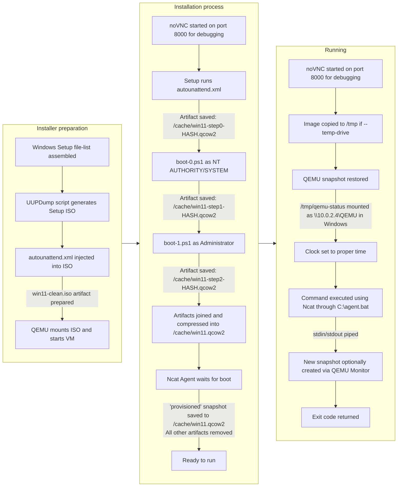

# osrun

A docker container to run Windows commands and processes. Windows is downloaded, installed, snapshotted and made available for fast access.

## Features

- ⚡️ Super fast execution once image is cached (1-2 seconds to start from snapshot)
- 🖥️ Browser-based VNC server to view the Windows desktop (forward port 8000)
- ⌨️ Support for interactive commands (like `cmd.exe` or `powershell.exe`) and piping output/input
- 🖱️ GUI apps (like `notepad.exe` or `chrome.exe`) are supported
- 🌍 Windows 11 is automatically downloaded and installed from Microsoft's servers
- 📸 Snapshot support to quickly load different states
- 🐳 All available as a convenient Docker image!

## Usage

```bash
# Linux
docker run -it --rm --device=/dev/kvm -v $(pwd)/cache:/cache ghcr.io/lg/osrun 'dir "C:\Program Files"'

# MacOS (installation will be very slow)
docker run -it --rm -v $(pwd)/cache:/cache ghcr.io/lg/osrun 'dir "C:\Program Files"'
```
<pre style="font-size: small">
 Volume in drive C is Windows 11
 Volume Serial Number is F48D-7158

 Directory of C:\Program Files

08/06/2023  09:24 PM    &lt;DIR&gt;          .
05/06/2022  10:42 PM    &lt;DIR&gt;          Common Files
05/07/2022  12:38 AM    &lt;DIR&gt;          Internet Explorer
...
</pre>

```text
Usage: osrun [flags] '<command>'
Short-lived containerized Windows instances

  -h --help: Display this help
  -v --verbose: Verbose mode

Install
  -k --keep: Keep install artifacts after successful provisioning

Run
  -t --temp-drive: Copies drive to /tmp before running, then discards (use with a tmpfs mount)
  -p --pause: Do not close the VM after the command finishes
  -n --new-snapshot <name>: Generate a new snapshot after the command finishes
  -s --use-snapshot <name>: Restore from the specified snapshot (default: provisioned)
```

## Developing

```bash
# Build the container
docker build -t osrun .

# Install Windows and run a command
docker run -it --rm --device=/dev/kvm -v $(pwd)/cache:/cache -p 8000:8000 osrun -k -v -p 'dir "C:\Program Files"'
```

This project is intended to be developed inside of VSCode. Because the KVM acceleration is substantial, it's suggested that you either run things on a Linux machine or use VSCode's Remote functionality to remotely develop on a Linux machine (and port forward port 8000 for noVNC).

## Protips

- **Don't forget to mount the cache directory in Docker and passthrough kvm**
- Use single quotes around the run command to avoid shell expansion. There is no need for double backslashes in Windows paths. Ex: `osrun 'dir "C:\Program Files"'`.
- Take advantage of noVNC, `--verbose` and `--pause` to debug installation/execution.
- Enable auto-reconnect on noVNC and also use "Local Scaling" and "Show Dot when No Cursor".
- You can inspect the container state using `docker exec -it <container-id> ash`.
- You can enter the QEMU Monitor using `docker exec -it <container-id> socat tcp:127.0.0.1:55556 readline` or just `socat tcp:127.0.0.1:55556 readline` locally if you forwarded the port.
- Consider `--temp-drive` for potentially faster runs (see caveats below).

## Details

This container uses [QEMU](https://www.qemu.org/) to run a Windows 11 VM. Windows 11 is built with the file list from [UUP dump](https://uupdump.net/) (or a backup server) and files are downloaded directly from Microsoft's Windows Update servers. The [UUP dump script](https://github.com/uup-dump/converter) generates a Windows ISO into which we then add an `autounattend.xml` script to start the installation automation. To keep the resultant VM small (~6GB) and fast we remove a lot of the default Windows components and services including Windows Defender, Windows Update, Edge, most default apps, and also disable things like paging, sleep and hibernation, plus the hard drive is compressed and trimmed. This process is done by the files in the `win11-init` directory. This image and VM state is then snapshotted when the system is stable and is saved to a cache directory so that subsequent runs start quickly.

On a reasonably modern machine the installation process takes about 20 minutes end-to-end and runs take about 1-2 seconds for simple commands like `dir`. Without KVM expect the installation to take about 2-3 hours and runs to take about 30 seconds even on fast machines like the M2 Macs.



Communication between the QEMU VM and the Docker container is done via Netcat (ncat in particular). A variety of other options were explored like ssh, QEMU Agent, WinRM and WMIC, but most options don't make Desktop-interactivity possible (so you can't launch things like web browsers or Notepad, etc). During installation and execution, multiple debugging services are started (you'll need to forward these ports using Docker if you want to use them outside the container):
- a noVNC HTTP server is started on port `8000` to view the VM's display,
- the raw QEMU-run VNC server is also available on port `5950` (not compatible with Apple Screen Sharing) if you don't prefer noVNC,
- the QEMU Monitor (ie. command-line interface) is available on port `55556` (supported commands are [here](https://qemu-project.gitlab.io/qemu/system/monitor.html)),
- the QEMU Guest Agent is available on port `44444` (its JSON protocol is [here](https://qemu.readthedocs.io/en/latest/interop/qemu-ga-ref.html)) and
- the Ncat agent is available on port `5454` to send raw commandline commands.

```mermaid
flowchart LR
  subgraph "Host machine"
    subgraph "Docker Container"
      subgraph "QEMU VM"
        A[["\\10.0.2.4\qemu"]]
        S[["C:\agent.bat"]]
        D["virtio display"]
        I["QEMU Agent"]
        A<--When installing---O[["\\10.0.2.4\qemu\status.txt"]]
      end

      A<-->B[["/tmp/qemu-status"]]
      D-->E["QEMU VNC server"]
      G["QEMU Monitor"]
      K[["/cache"]]
      K-.Image copied when using temp-drive-.->K2[["/tmp/win11.qcow2"]]
      L[["/win11-init/*.ps1"]]-.Mounted into on install.->A
      E-.Port 5950.->R["HTTP server w/ websockets proxy"]
    end

    P-.Port 5454.->Q["Ncat agent"]
    R-.Port 8000.->Q["noVNC HTTP frontend"]
    E-.Port 5950.->F["VNC client"]
    G-.Port 55556.->H["QEMU Monitor client"]
    I-.Port 44444.->J["QEMU Agent client"]
    K--Docker Volume-->M[["Directory"]]
  end
```

### The `--temp-drive` flag

Due to [limitations](https://bugs.launchpad.net/qemu/+bug/1184089) in QEMU, even though we load a snapshot every time the image will still get written to and will therefore grow over time. Additionally in a shared-mount scenario, only one VM will be able to access this drive at the same time due to QEMU's locking.

Use `--temp-drive` to create a temporary copy the image into `/tmp` in the container before running QEMU. Though the copy can be slow, this can be leveraged with docker's `--tmpfs /tmp` flag to memory-mount this drive if you have the memory for potentially added performance depending on the workload. Be careful though, these images can get big and you may run out of memory. When not using tmpfs, docker will just use your hard drive as temporary storage and the discard the modified image at the end.

*Note*: Using `--temp-drive` and `--new-snapshot` together will not update the base image unless you mount `/tmp` elsewhere and copy the drive image file back as part of another workflow.

### The `--new-snapshot` and `--use-snapshot` flags

While the final image will always have a `provisioned` snapshot, you can create new snapshots from the VM end-state of your command using the `--new-snapshot <name>` flag. You can then use this snapshot for subsequent runs using the `--use-snapshot <name>` flag. This is useful if you need to change the VM's configuration or install a tool on top of the base `provisioned` snapshot. Behind the scenes this uses the `savevm` and `loadvm` commands on the QEMU Monitor protocol which snapshots memory and disk state into the main `qcow2` image.

As an example (in order):

1. `osrun --new-snapshot greeted 'mkdir C:\hello'`
    ```mermaid
    flowchart LR
      A["'provisioned' snapshot restored"]
      -->B["mkdir executed"]
      -->C["New 'greeted' snapshot created"]
    ```

2. `osrun --use-snapshot greeted 'dir C:\'`
    ```mermaid
    flowchart LR
      A["'greeted' snapshot restored"]
      -->B["dir executed, will display the 'hello' directory"]
    ```

3. `osrun 'dir C:\'`
    ```mermaid
    flowchart LR
      A["'provisioned' snapshot restored"]
      -->B["dir executed, will not display the 'hello' directory"]
    ```

### TODO

- [ ] Add support for Windows 10 / MacOS
- [ ] Figure out if hvf acceleration is at all possible for MacOS
- [ ] Add exit code and stderr support again
