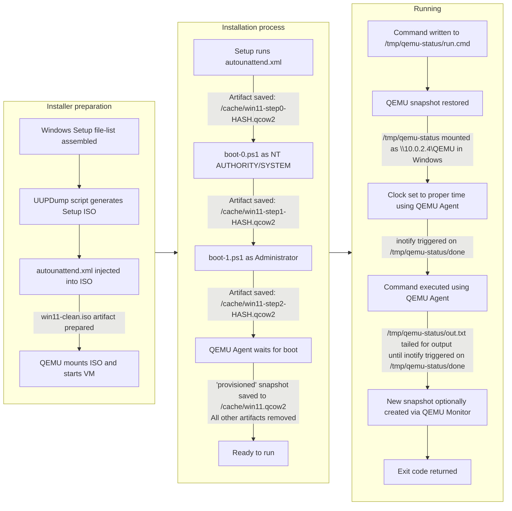

# osrun

A docker container to run Windows commands and processes. On first run it will generate a Windows 11 ISO and run a VM to install it and create a system snapshot. On subsequent runs it will use the existing cached VM image.

## Usage

<pre>
<span style="filter: brightness(0.75)">docker run -it --rm --device=/dev/kvm -v $(pwd)/cache:/cache \</span>
  ghcr.io/lg/osrun 'dir "C:\Program Files"'
</pre>
<pre style="font-size: small">
 Volume in drive C is Windows 11
 Volume Serial Number is F48D-7158

 Directory of C:\Program Files

08/06/2023  09:24 PM    &lt;DIR&gt;          .
05/06/2022  10:42 PM    &lt;DIR&gt;          Common Files
05/07/2022  12:38 AM    &lt;DIR&gt;          Internet Explorer
...
</pre>

```text
Usage: osrun [flags] '<command>'
Short-lived containerized Windows instances

  -h --help: Display this help
  -v --verbose: Verbose mode (default: false)

Install
  -k --keep: Keep the installation ISOs after successful provisioning (default: false)

Run
  -p --pause: Do not close the VM after the command finishes (default: false)
  -n --new-snapshot <name>: Generate a new snapshot after the command finishes
  -s --use-snapshot <name>: Restore from the specified snapshot (default: provisioned)
```

If you don't have kvm on your machine, you can skip the parameter, but things will be a lot slower. This mode is currently unreliable and may freeze during Windows 11 installation.

## Details

This container uses [QEMU](https://www.qemu.org/) to run a Windows 11 VM. Windows 11 is built with the file list from [UUP dump](https://uupdump.net/) and files are downloaded directly from Microsoft's Windows Update servers. The UUP dump script generates a Windows ISO which we then inject an `autounattend.xml` script to start the installation automation. To keep the resultant VM small and fast we remove a lot of the default Windows components and services including Windows Defender, Windows Update, most default apps, and also disable things like paging, sleep and hibernation, plus the hard drive is compressed and trimmed to be <10GB. THese are the files in the `win11-init` directory. This image and VM state is then snapshotted and saved to a cache directory so that subsequent runs can use the cached VM state to startup quickly. On a reasonably fast machine the installation process takes about 20 minutes end-to-end and runs take about 3-4 seconds for simple commands like `dir`.



Communication between the VM and the host is done via the QEMU Agent and a QEMU-started Samba server (available in the host container in `/tmp/qemu-status` or in the VM in `\\10.0.2.4\qemu`). During installation and execution, multiple debugging services are started (you'll need to forward these ports using Docker if you want to use them):
- a QEMU-run VNC server is available on port `5950` (not compatible with Apple Screen Sharing),
- the QEMU Monitor is available on port `55556` (supported commands are [here](https://qemu-project.gitlab.io/qemu/system/monitor.html)), and
- the QEMU Agent is available on port `44444` (protocol is [here](https://qemu.readthedocs.io/en/latest/interop/qemu-ga-ref.html)).

```mermaid
flowchart LR
  subgraph "Docker Container"
    subgraph "QEMU VM"
      A[["\\10.0.2.4\qemu"]]
      D["virtio display"]
      I["QEMU Agent"]
      A<--When running---N[["\\10.0.2.4\qemu\done"]]
      A<--When installing---O[["\\10.0.2.4\qemu\status.txt"]]
      A<--When running---P[["\\10.0.2.4\qemu\out.txt"]]
    end

    A<-->B[["/tmp/qemu-status"]]
    D-->E["QEMU VNC server"]
    G["QEMU Monitor"]
    K[["/cache"]]
    L[["/win11-init/*.ps1"]]<-.Mounted on Install.->A
  end

  E-.Port 5950.->F["VNC client"]
  G-.Port 55556.->H["QEMU Monitor client"]
  I-.Port 44444.->J["QEMU Agent client"]
  K<--Docker Volume-->M[["Directory"]]
```

### The `--new-snapshot` and `--use-snapshot` flags

While the final image will always have a `provisioned` snapshot, you can create new snapshots using the `--new-snapshot` flag. This will create a new snapshot with the specified name after the command you ran finishes. You can then use this snapshot for subsequent runs using the `--use-snapshot` flag. This is useful if you need to change configuration or install a tool (ex. Chrome) on top of the base `provisioned` snapshot and start from that state (using `--use-snapshot`). Behind the scenes this uses the `savevm` and `loadvm` commands on the QEMU Monitor protocol which snapshots memory and disk state into the main qcow2 image.

As an example:

1. `osrun --new-snapshot greeted 'mkdir C:\hello'`
    ```mermaid
    flowchart LR
      A["'provisioned' snapshot restored"]
      -->B["mkdir executed"]
      -->C["New 'greeted' snapshot created"]
    ```

2. `osrun --use-snapshot greeted 'dir C:\'`
    ```mermaid
    flowchart LR
      A["'greeted' snapshot restored"]
      -->B["dir executed, will display the 'hello' directory"]
    ```

3. `osrun 'dir C:\'`
    ```mermaid
    flowchart LR
      A["'provisioned' snapshot restored"]
      -->B["dir executed, will not display the 'hello' directory"]
    ```
